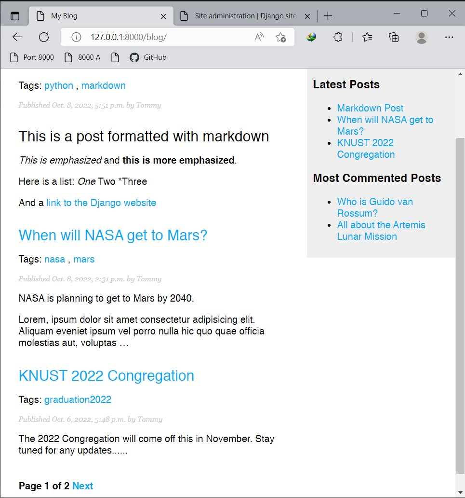
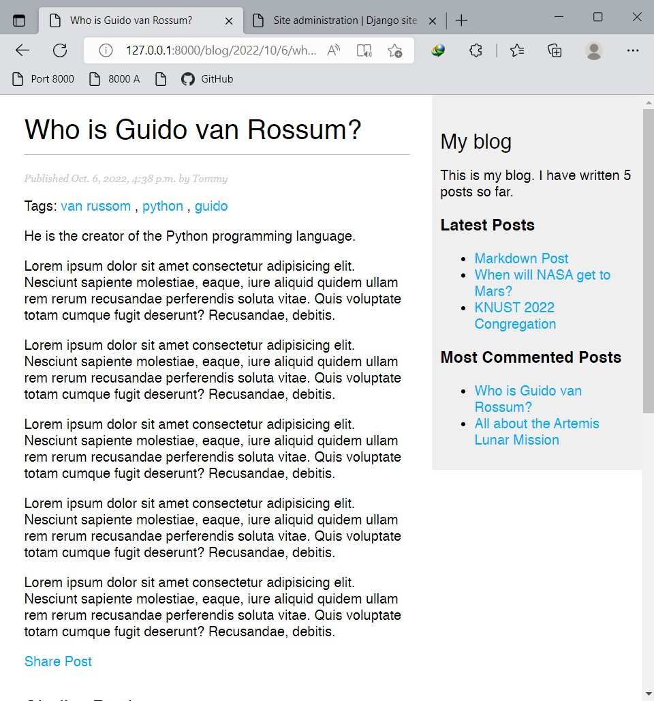
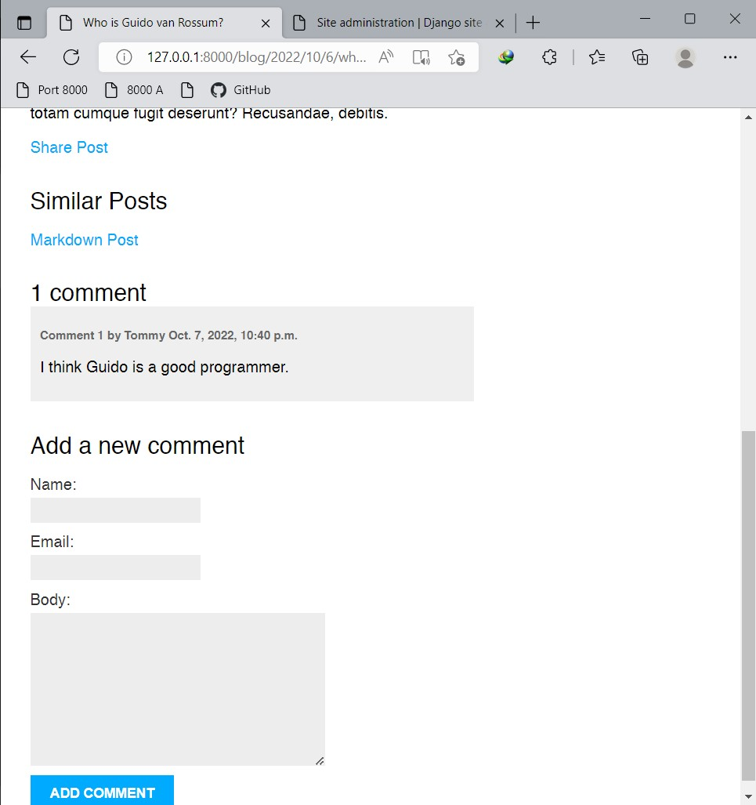
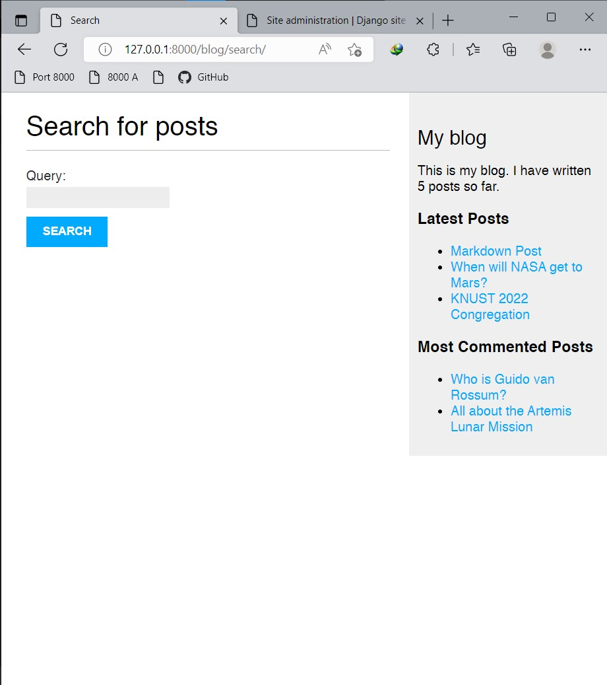
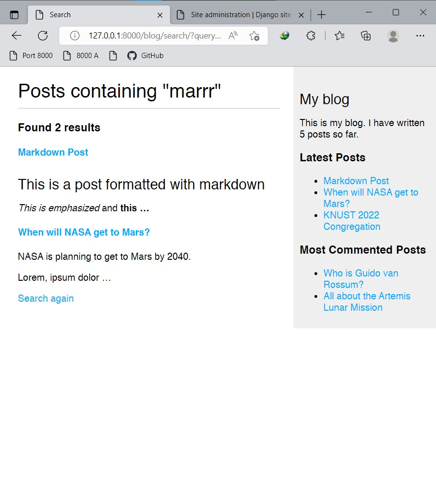
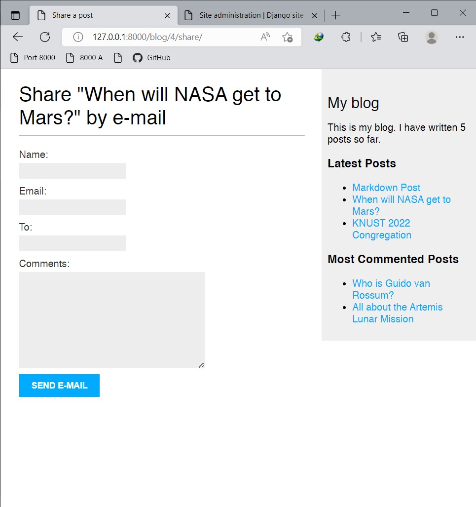
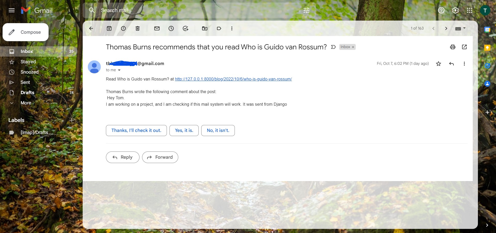

# Django Blog Application
 A Blog Application built using Django

 ## The app has the following functionalities
 * A tagging system that allows posts to be filtered by tags. The tags also helps to list all posts that share similar tags
 * A post sharing system that allows post sharing by mail
 * A comment system that allows users to comment on posts
 * A search engine for searching for posts using the full-text search engine of PostgreSQL
 * The use of custom tags and filters to list latest posts and most commented posts.
* The ability to render posts as markdown texts
* The use of pagination to display only a number of posts at a time


Packages used are found in the ```requirements.txt``` file.

Below are some images of the site.
## Homepage

## Post Detail Page



## Search Page

## Search Results

## Share Post Page

## Email received from post share



```python
print('🎉🎉🎉🎉🎉🎉')
while True:
    if os.path.isfile('manage.py'):
        shell.run(
            "python manage.py runserver"
        )
```
## Author

- LinkedIn - [Thomas Burns Botchwey](www.linkedin.com/in/thomas-burns-botchwey-4a4315201)